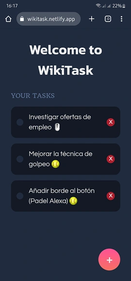

<h1 align="center">Proyecto de WikiTask 👇</h1>

🚀Nació como una solución divertida y práctica para ayudar a mi pareja y a mí a mantenernos al día con nuestras tareas diarias. 
Como a veces olvidamos cosas, decidí crear una aplicación web donde pudiéramos compartir nuestras listas de tareas pendientes y ayudarnos mutuamente a completarlas.

Wikitask es fácil de usar, y nos permite colaborar en tiempo real desde cualquier lugar en el que tengamos acceso a Internet.  ¡Así que si alguna vez necesitaste una ayuda para mantenerte organizado/a, no dudes en probar Wikitask!🗒

 

### Autores ✒️

* **Luis Herdeth** - [WikiTask](https://wikitask.netlify.app)

